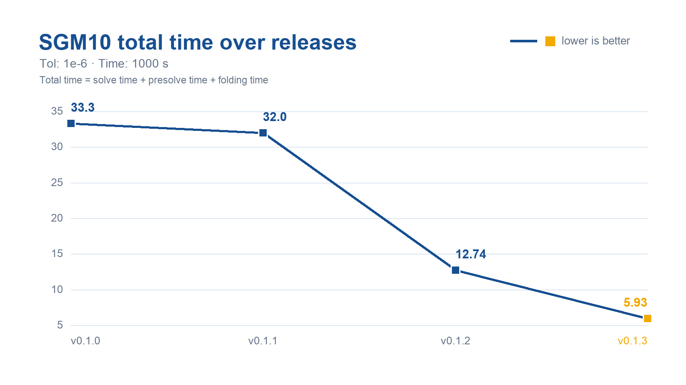
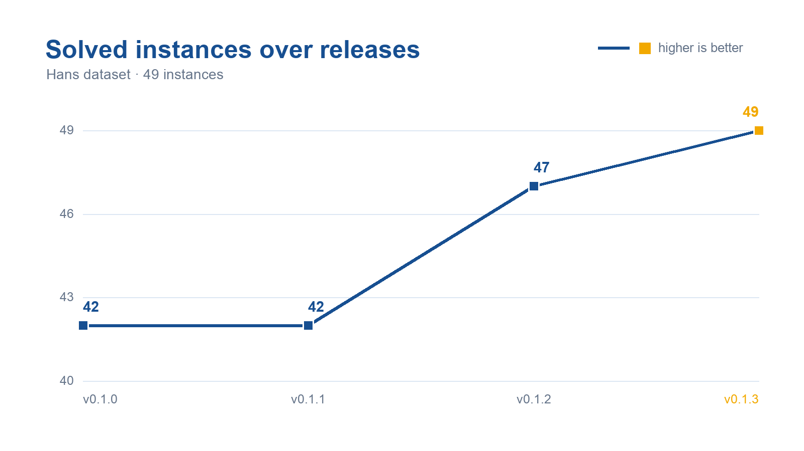

# HPR-LP-C

HPR-LP-C is a GPU-accelerated C/CUDA implementation of the Halpern Peaceman--Rachford method for solving linear programming problems.

## What's new in v0.1.3

Version 0.1.3 focuses on faster, more robust large-scale LP solving:

- GPU-Presolver-C integration with optional folding;
- adaptive row and column reduction;
- enhanced CUDA kernels and CUDA graph batching.

On the 49-instance Hans benchmark, v0.1.3 solved all 49 instances and reduced
SGM10 total time from 12.74 in v0.1.2 to 5.93—about 2.15x
faster.





## Quick start

Clone the public repository and build the solver:

```bash
git clone https://github.com/PolyU-IOR/HPR-LP-C.git
cd HPR-LP-C
make clean && make -j
./build/solve_mps_file -i data/model.mps --tol 1e-6 --time-limit 1000
```

For a downloaded release archive:

```bash
unzip HPR-LP-C-0.1.3.zip
cd HPR-LP-C-0.1.3
make clean && make -j
./build/solve_mps_file -i data/model.mps --tol 1e-6 --time-limit 1000
```

The build creates:

- `build/solve_mps_file`;
- `lib/libhprlp.a`; and
- `lib/libhprlp.so`.

The Makefile detects the first visible GPU through `nvidia-smi`, so no
architecture argument is needed for these GPU families:

| GPU family | Compute capability | Build architecture |
|---|---:|---:|
| NVIDIA B200 | 10.0 | `sm_100` |
| NVIDIA H100 | 9.0 | `sm_90` |
| NVIDIA A100 | 8.0 | `sm_80` |
| GeForce RTX 30 series | 8.6 | `sm_86` |
| GeForce RTX 40 series | 8.9 | `sm_89` |
| GeForce RTX 50 series | 12.0 | `sm_120` |

The numeric compute capability is preferred; GPU-name matching provides a
fallback for `nvidia-smi` versions that cannot report it. Build with:

```bash
make clean && make -j
```

The selected CUDA Toolkit must support the detected architecture. If no GPU is
visible, `nvcc` chooses its supported default. Run `make help` to inspect the
selection; `GPU_SM=<arch>` remains available for cross-builds.

## Features

- Reads free or fixed MPS files, including `.mps.gz`.
- Provides a command-line solver and C/C++ library.
- Supports selectable embedded PSLP or GPU-Presolver-C presolve and postsolve.
- Supports batched LPs that share one sparse constraint matrix.
- Provides optional Python, Julia, and MATLAB interfaces.
- Automatically selects eligible CUDA implementations from verified matrix
  structure; `--cusparse-spmv true` forces the cuSPARSE path.
- Amortizes normal-iteration launch overhead with a boundary-safe,
  fixed-size CUDA graph batch.

## Requirements

The core solver requires:

- Linux on x86-64;
- an NVIDIA GPU supported by the selected CUDA Toolkit;
- an NVIDIA CUDA Toolkit including `nvcc`, cuBLAS, cuSOLVER,
  cuSPARSE, and the CUDA driver development library;
- GCC/G++ with C++17 support, supported by the selected CUDA Toolkit
  (GCC 9--12 recommended);
- GNU Make or CMake 3.18 or newer; and
- zlib development headers.

### cuSPARSE backend

CUDA 13.3 and newer enable NVIDIA's experimental `cusparseSpMVOp` API and use
`CUSPARSE_SPMVOP_ALG1`. Older toolkits use the regular `cusparseSpMV` API with
`CUSPARSE_SPMV_CSR_ALG2`. Selection happens at compile time from the chosen
toolkit headers; no user option is required.

See NVIDIA's [cuSPARSE SpMVOp API reference](https://docs.nvidia.com/cuda/cusparse/#cusparsespmvop-experimental)
and [CUDA Toolkit 13.3 release notes](https://docs.nvidia.com/cuda/cuda-toolkit-release-notes/).

On Ubuntu 22.04:

```bash
sudo apt-get update
sudo apt-get install -y build-essential cmake zlib1g-dev
```

Install the CUDA Toolkit separately using NVIDIA's instructions. If CUDA is
not installed at `/usr/local/cuda`, set `CUDA_PATH` or `CUDA_HOME`.

## CMake build and installation

```bash
CUDA_PATH="${CUDA_PATH:-/usr/local/cuda}"
cmake -S . -B build-cmake \
  -DCMAKE_BUILD_TYPE=Release \
  -DCMAKE_CUDA_COMPILER="$CUDA_PATH/bin/nvcc"
cmake --build build-cmake
cmake --install build-cmake --prefix "$HOME/.local"
```

The preceding command detects the first visible GPU automatically. For a
reproducible H100 cross-build, use a separate build directory and set compute
capability 9.0:

```bash
CUDA_PATH="${CUDA_PATH:-/usr/local/cuda}"
cmake -S . -B build-h100 \
  -DCMAKE_BUILD_TYPE=Release \
  -DCMAKE_CUDA_COMPILER="$CUDA_PATH/bin/nvcc" \
  -DCMAKE_CUDA_ARCHITECTURES=90
cmake --build build-h100
```

Using a separate directory prevents cached architecture settings and object
files from being reused for a different GPU. An explicit
`CMAKE_CUDA_ARCHITECTURES` value always overrides automatic detection.

### GPU-Presolver-C backend

The source tree vendors `PolyU-IOR/GPU-Presolver-C` under
`third_party/GPU-Presolver-C`. Make and CMake build this backend by default;
its source files and the HPR-LP-C core use the C++/CUDA 17 language standard.
To create a smaller PSLP-only CMake build, set `BUILD_GPU_PRESOLVER=OFF`.

```bash
./build/solve_mps_file \
  -i problem.mps.gz \
  --presolver gpu \
  --gpu-folding true
```

Use `--presolver pslp` for the original embedded PSLP path or
`--presolver none` to solve without presolve.

For a Make-based staged installation:

```bash
make clean && make -j
make install PREFIX="$HOME/.local"
```

Add the selected prefix to `PATH` and the dynamic-loader path when it is not a
system location:

```bash
export PATH="$HOME/.local/bin:$PATH"
export LD_LIBRARY_PATH="$HOME/.local/lib:${LD_LIBRARY_PATH:-}"
```

## Command-line usage

```bash
./build/solve_mps_file -i data_path --tol 1e-6 --time-limit 1000
```

| Option | Description | Default |
|---|---|---:|
| `-i`, `--input <path>` | Input `.mps` or `.mps.gz` file | required |
| `--device <id>` | CUDA device index | `0` |
| `--max-iter <N>` | Maximum iterations | `INT32_MAX` |
| `--tol <eps>` | Stopping tolerance | `1e-6` |
| `--time-limit <sec>` | Time limit in seconds | `1000` |
| `--check-iter <N>` | Convergence-check interval | `150` |
| `--cusparse-spmv <bool>` | Force cuSPARSE normal updates | `false` |
| `--autotune-verbose <bool>` | Print backend-selection diagnostics | `false` |
| `--print-debug-info <bool>` | Print detailed presolve, backend, scaling, restart, and timing diagnostics | `false` |
| `--cr <bool>` | Curtis--Reid prescaling | `true` |
| `--ruiz <bool>` | Ruiz scaling | `true` |
| `--pock <bool>` | Pock--Chambolle scaling | `true` |
| `--bc <bool>` | Bounds and cost scaling | `true` |
| `--presolver <pslp\|gpu\|none>` | Select presolver backend | `gpu` |
| `--gpu-folding <bool>` | Enable folding for GPU-Presolver-C | `true` |
| `--reduced-matrix <bool>` | Enable adaptive row/column reduction | `true` |

Boolean values accept `true` or `1`; other values are treated as false.

By default, logs contain the instance name, model dimensions, explicitly
supplied solver options, the iteration table, and a compact solution summary.
Use `--print-debug-info true` to restore the full diagnostic log.

Reduced-matrix mode is controlled by the single `use_reduced_matrix` C/C++
parameter (or `--reduced-matrix` in either dataset runner). When enabled, mask
maintenance begins below a `1e-2` KKT residual.  Column entry requires less
than 50% free columns and row entry less than 40% active rows for three stable
checks (or less than 25% immediately).  If both candidates are ready, the
solver selects the direction with the smaller retained dimension ratio.
Set `HPRLP_USE_ROW_REDUCTION=0` for the former column-only behavior.
Release validation uses `--tol 1e-6`, `--time-limit 1000`, and
`--check-iter 150`; pass these options explicitly when comparing runs.

## Hans dataset run and CSV summary

The batch script runs sorted `*.mps.gz` files, resumes from rows already
present, and rewrites `SGM10` and `solved` rows at the bottom of
`HPRLP_result.csv`. Pass a comma-separated device list with `--devices`. One
worker is bound to each device; whenever it finishes an instance, it takes the
next pending instance. Completed rows are serialized into the shared CSV, and
line-buffered instance logs are written automatically to
`<output directory>/logs/<instance_name>.log`. The combined run log remains in
`HPRLP_log.txt`; `--logs-dir` can override the instance-log directory, and
`--failed-out` enables a failed-instance CSV. The existing `--device` option is
retained as the single-device fallback when `--devices` is omitted.
Only solver options supplied explicitly on the script command line (or through
their corresponding `HPRLP_*` environment variables) are forwarded to
`solve_mps_file`; `--devices` is translated to one `--device` assignment per
worker.

```bash
python3 scripts/run_hans_dataset.py \
  --data-dir /path/to/Hans \
  --solver ./build/solve_mps_file \
  --out-dir Results/hans \
  --presolver gpu \
  --gpu-folding true \
  --devices 0,1,2 \
  --time-limit 1000 \
  --tol 1e-6 \
  --check-iter 150
```

## Julia dataset run

The Julia runner uses one isolated Julia process per requested GPU. The next
pending instance is assigned to whichever worker becomes available first;
completed rows are serialized by the parent into `results.csv`. It resumes from
existing CSV entries by default and writes line-buffered solver output to
`logs/<instance_name>.log`, with scheduler messages in `batch_solve.log`.

```bash
julia scripts/run_dataset.jl /path/to/Hans Results/julia_hans \
  --devices 0,1,2 \
  --presolver gpu --gpu-folding true --tol 1e-6 --time-limit 1000
```

Use `--device 0` for the backward-compatible single-device form and
`--no-resume` to replace an existing CSV. Its CSV includes MPS read time and
every field in `HPRLP_time`. The progress monitor, progress control, and sigma
rebalance/restart controls follow the current C defaults unless explicitly
overridden by their corresponding command-line options.

## C and C++ examples

Build the core library first, then compile and run the examples:

```bash
make clean && make -j
make -C examples/c run
make -C examples/cpp run
```

The public API is declared in [`include/HPRLP.h`](include/HPRLP.h). The
examples demonstrate direct array input, MPS input, and batched shared-matrix
solves.

## Batched shared-matrix solves

The C API exposes `solve_batched` for a family of LPs with one sparse matrix
`A` and different dense data:

```text
minimize    c_k' x + objective_constant_k
subject to  AL_k <= A x <= AU_k
            l_k <= x <= u_k
```

Dense batched inputs are column-major. `C`, `l`, and `u` have shape
`n x batch_size`; `AL` and `AU` have shape `m x batch_size`.

## Language interfaces

### Python

Python requires Python 3.8 or newer, CMake, pybind11, NumPy, and SciPy.
Installation compiles the CUDA core:

```bash
python3 -m venv .venv
. .venv/bin/activate
python -m pip install --upgrade pip
python -m pip install ./bindings/python
python bindings/python/examples/example_direct_lp.py
```

See [`bindings/python/README.md`](bindings/python/README.md).

### Julia

Build the shared library first, then instantiate the Julia package:

```bash
make clean && make -j
bash bindings/julia/install.sh
julia --project=bindings/julia/package \
  bindings/julia/examples/example_direct_lp.jl
```

See [`bindings/julia/README.md`](bindings/julia/README.md).

### MATLAB

The MATLAB interface requires Linux, MATLAB R2018a or newer, a compatible
MEX compiler, and the CUDA Toolkit:

```bash
bash bindings/matlab/install.sh
```

See [`bindings/matlab/README.md`](bindings/matlab/README.md).

## Runtime behavior and portability

- HPR-LP-C has no CPU solver backend.
- General structured backends are enabled only after lossless runtime checks.
  Unsupported matrices use the canonical cuSPARSE implementation:
  `cusparseSpMVOp` on CUDA 13.3+ and `cusparseSpMV` on older toolkits.
- CUDA virtual-memory allocation is opportunistic; unsupported systems use
  ordinary `cudaMalloc`.
- Each binary targets the detected or explicitly selected architecture; it is
  not portable across incompatible GPU architectures. Plain `make` recognizes
  B200, H100, A100, and GeForce RTX 30/40/50 series GPUs. For cross-builds, use
  `GPU_SM=<arch>` or
  `-DCMAKE_CUDA_ARCHITECTURES=<arch>` explicitly.
- Runtime-selected matrix backends can still differ with model structure.

## Troubleshooting

### CUDA compiler not found

```bash
export CUDA_PATH=/usr/local/cuda
export PATH="$CUDA_PATH/bin:$PATH"
make clean && make -j
```

On systems with more than one `nvcc`, prefer the selected CUDA installation
explicitly. Architecture selection remains automatic:

```bash
export CUDA_PATH=/usr/local/cuda
export PATH="$CUDA_PATH/bin:$PATH"
make clean && make -j
```

### Unsupported host compiler

Select a GCC version supported by your CUDA release:

```bash
sudo apt-get install -y gcc-12 g++-12
make clean && make -j
```

### Shared library not found

When running a locally installed executable or language interface:

```bash
export LD_LIBRARY_PATH="/path/to/HPR-LP-C/lib:${LD_LIBRARY_PATH:-}"
```

## Version provenance

This portable NVIDIA CUDA edition of version 0.1.3 extends the official
[`PolyU-IOR/HPR-LP-C`](https://github.com/PolyU-IOR/HPR-LP-C) 0.1.2 source at
commit `358295ca9af3a9f1413174f2f63e5bdf3032c548`. See
[`CHANGELOG.md`](CHANGELOG.md) for the public changes in this release.

## Citation

Kaihuang Chen, Defeng Sun, Yancheng Yuan, Guojun Zhang, and Xinyuan Zhao,
“HPR-LP: An implementation of an HPR method for solving linear programming,”
*Mathematical Programming Computation*, 17(4), 2025.
[DOI: 10.1007/s12532-025-00292-0](https://doi.org/10.1007/s12532-025-00292-0).

## License

HPR-LP-C is released under the MIT License. See [`LICENSE`](LICENSE).
The vendored presolvers retain their own notices in
[`third_party/PSLP/LICENSE`](third_party/PSLP/LICENSE) and
[`third_party/GPU-Presolver-C/LICENSE`](third_party/GPU-Presolver-C/LICENSE).

## Contributing and support

See [`CONTRIBUTING.md`](CONTRIBUTING.md). For questions or bug reports, open
an issue at <https://github.com/PolyU-IOR/HPR-LP-C/issues>.
